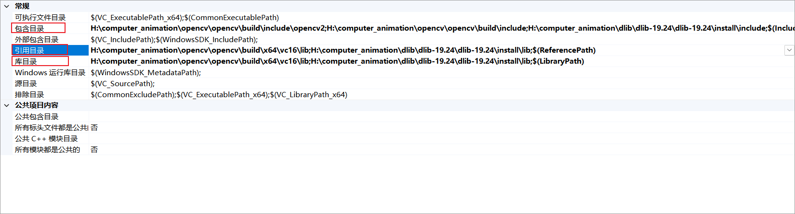
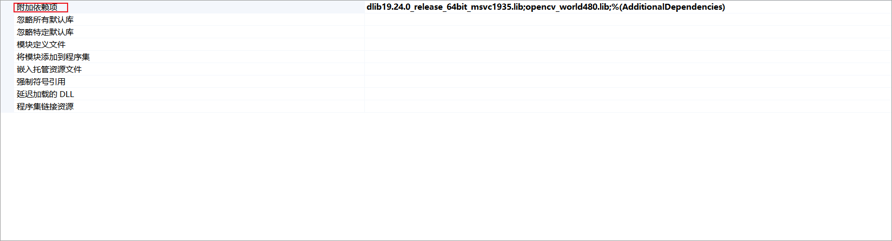
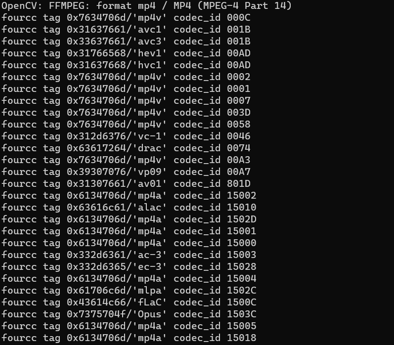

# 浙江大学实验报告

课程名称：计算机动画
实验类型：综合
实验项目名称：基于Delaunay三角剖分的二维人脸图像morphing
学生姓名：朱镐哲
专业：信息安全
学号：3210103283
指导老师：金小刚
实验地点：玉泉
实验日期：2023年10月30日

## 一、实验目的和要求

实验目的:

1. 探索和理解Delaunay三角剖分算法的原理和应用，特别是在人脸图像处理领域。
2. 开发二维人脸图像morphing算法，以实现平滑的人脸过渡效果。
3. 研究和分析不同参数设置和方法对人脸morphing结果的影响，以获得最佳效果。
4. 了解人脸图像处理在计算机视觉和图形学中的潜在应用，如虚拟化、面部动画等。

实验要求:

1. 学习Delaunay三角剖分算法的原理，包括如何生成三角网格以便进行morphing。
2. 实现一个可视化工具或编程代码，用于执行人脸图像morphing，包括图像的三角剖分、特征点的选择和插值。
3. 生成morphing效果图像和动画，展示实验结果。
4. 编写实验报告，描述实验设计、实施和结果分析。
5. 思考潜在应用领域，如面部合成、虚拟娱乐等，以展示这一技术的实际用途。

## 二、实验内容和原理

**实验内容**：

- 实现一个可视化工具或编程代码，用于执行人脸图像morphing，包括图像的三角剖分、特征点的选择和插值。生成morphing效果图像和动画，展示实验结果。

**实验原理**：

1. **Delaunay三角剖分原理**:

   Delaunay三角剖分是一种计算几何学中的方法，用于将给定的点集分割成无重叠的三角形，以满足特定的拓扑性质。在人脸图像morphing中，Delaunay三角剖分被用于将起始图像和目标图像上的对应的特征点（如眼睛、鼻子、嘴巴等）连接起来，生成一组相同数量的相似三角形。这些三角形将用于插值过程，以在起始和目标图像之间创建平滑的过渡。

2. **人脸图像morphing原理**:

   人脸图像morphing是一种图像处理技术，旨在将一个人脸图像逐渐转换成另一个人脸图像，产生一种平滑的过渡效果。这个过程可以通过以下步骤实现：

   a. 特征点选择: 选择起始图像和目标图像上的特征点，这些特征点用于指定人脸的关键结构，例如眼睛、嘴巴、鼻子等。

   b. 三角剖分: 对于选定的特征点，进行Delaunay三角剖分，生成一组相同数量的三角形。

   c. 插值: 在两个图像之间进行插值，根据每个三角形内的特征点的位置，以逐渐变换起始图像中的每个三角形到目标图像中对应的三角形。这可以通过对颜色、亮度和特征点位置进行插值来实现。

   d. 动画: 创建一系列中间图像，以实现平滑的过渡效果，从起始图像变换到目标图像。这形成了一个morphing动画。

   e. 可视化: 最终，生成morphing效果图像或动画，以展示起始和目标图像之间的平滑过渡。

## 三、实验环境

实验编译运行平台：windows11 visual Studio 2022

实验代码库：OpenCV-4.8.0，dlib ver.19.24，shape_predictor_68_face_landmarks.dat模型

### 实验环境配置

- <https://opencv.org/releases/>进入官网进行下载，我下载的版本为OpenCV-4.8.0。之后解压文件到指定文件夹。配置OpenCV的bin目录为系统环境变量。
- <http://dlib.net/>进入官网进行下载，我下载的版本为19.24，解压文件到指定文件夹。接下来对其进行编译，运行cmake-gui
  - 在解压的dlib文件夹下新建build和install文件夹。
  - 配置源码目录为当前解压的目录。
  - 配置编译目录为build目录。
  - 点击Configue，配置CMAKE_INSTALL_PREFIX为install目录。
  - 点击Generate生成，点击open project进入Visual Studio：选择Release和X64，右键点击ALL_BUILD，选择生成，右键点击INSTALL，选择生成，就完成了dlib的编译。
- 配置opencv与dlib在vs2022的配置
  - 添加库目录、引用目录、包含目录：
  - 添加依赖项：
- <http://dlib.net/files/shape_predictor_68_face_landmarks.dat.bz2>下载关键点检测模型。


## 四、实验步骤

### 步骤零：图像预处理

这一部分虽然是步骤零，但是却是我最后加上去的一部分代码，因为这是在我进行了数据测试之后所想到的，通过图像的预处理，程序可以实现更多的功能且能在一定程度上提高处理效果。

在实际情况中，一张图片可能会有多张人脸，而且人脸会有不同的大小（比如相同大小下，一寸照的人脸和全身照的人脸），如果直接进行morphing，效果不好，所以需要对图像进行一定的预处理。

图像预处理的函数是

```c++
int faceDetectionandCut(dlib::array2d<dlib::rgb_pixel>& img, std::string img_name, shape_predictor sp) { //参数依次为：通过rgb模式读入的彩色img，img图像源文件的名称，面部关键点检测器模型
```

顾名思义，预处理首先对输入的图片进行人脸检测，如果只有一张人脸，那么询问是否进行裁剪，如果有多张人脸，那么默认进行裁剪。在裁剪的时候，我们使用形状检测器来检测人脸的面部特征点，然后遍历面部特征点，记录`left_max` `right_max` `top_max` `bottom_max`四个边界的值，然后进行一定比例的延伸，并以人脸为中心进行裁剪，裁剪过程中也会进行检测（避免人脸在图片过于边缘的位置而导致裁剪越界的情况）。如果检测到多个人脸，则在图像上绘制矩形框，用于标记面部，并让用户选择一个面部（会在窗口中显示出来）进行裁切，裁切步骤与单张脸相似。

如下展示裁切多张脸的部分代码：

```c++
// 如果检测到多个人脸，则在图像上绘制矩形框，用于标记面部，并让用户选择一个面部进行裁切
cut = 1;

// 初始化一个用于标记的计数器
int counter = 1;

// 遍历检测到的面部，绘制矩形并添加标号
for (const dlib::rectangle& det : dets) {
	// 绘制一个矩形框围绕面部
	cv::rectangle(cvimg_display, cv::Point(det.left(), det.top()), cv::Point(det.right(), det.bottom()), cv::Scalar(0, 255, 0), 2);

	// 在矩形框的左上角添加标号
	cv::putText(cvimg_display, std::to_string(counter), cv::Point(det.left(), det.top() - 10), cv::FONT_HERSHEY_SIMPLEX, 0.6, cv::Scalar(0, 255, 0), 2);

	// 增加计数器
	counter++;
}

imshow("当前图像", cvimg_display);
cv::waitKey(0);

cout << "选择一张脸进行裁切：(输入数字) ";
int chosenface;
cin >> chosenface;

// 检查用户输入是否合法
while (chosenface < 1 || chosenface > dets.size()) {
	cout << "输入不合法，请重新输入： ";
	cin >> chosenface;
}

// 获取用户选择的面部
const dlib::rectangle& selectface = dets[chosenface - 1];

full_object_detection shape = sp(img, selectface);//用形状检测器来预测人脸的面部特征点

float left_max = shape.part(0).x();
float right_max = shape.part(0).x();
float top_max = shape.part(0).y();
float bottom_max = shape.part(0).y();
//遍历面部特征点，提取每个点的xy坐标，找出最边界的点

for (int i = 1; i < shape.num_parts(); ++i)
{
	float x = shape.part(i).x();
	float y = shape.part(i).y();
	left_max = std::min(left_max, x);
	right_max = std::max(right_max, x);
	top_max = std::min(top_max, y);
	bottom_max = std::max(bottom_max, y);
}

cout << left_max << " " << right_max << " " << top_max << " " << bottom_max << endl;
float face_width = right_max - left_max;
float face_height = bottom_max - top_max;
cut_width = face_width * 2;
cut_height = face_height * 2;

//计算裁切区域
int centerX = (selectface.left() + selectface.right()) / 2;
int centerY = (selectface.top() + selectface.bottom()) / 2;

int halfwidth = cut_width / 2;
int halfheight = cut_height / 2;

int head_left = std::max(0, centerX - halfwidth);
int head_right = std::min((int)img.nc(), centerX + halfwidth);
int head_top = std::max(0, centerY - halfheight);
int head_bottom = std::min((int)img.nr(), centerY + halfheight);

//裁切并调整区域
cout << head_left << " " << head_top << endl;
cv::Rect headRegion(head_left, head_top, head_right - head_left, head_bottom - head_top);
cv::Mat headROI = cvimg(headRegion);

//调整图像大小为标准大小
cv::resize(headROI, headROI, cv::Size(300, 320));

//保存裁切后的图像
std::string new_img_name = img_name + ".cut.jpg";
cv::imwrite(new_img_name, headROI);

cout << "裁切后的图片已保存为 " << new_img_name << endl;
```

### 步骤一：加载输入图像

经过预处理，两个图像都已经变为只有一张脸且已经经过了大致的裁切，脸的大小和方位，还有照片的大小和方位都是相似的。此时先对图像进行读入，两种库的读取方式并不相同，虽然Mat类型和array2d可以互相转化，但是还是两个分别进行读入。

```c++
//用dlib读取图片
dlib::array2d<unsigned char> img1, img2;
dlib::load_image(img1, pic1_file_name);
dlib::load_image(img2, pic2_file_name);
std::vector<Point2f> landmarks1, landmarks2;

//利用opencv读取图片，并进行检查
Mat img1CV = imread(pic1_file_name);
Mat img2CV = imread(pic2_file_name);
Mat img1CV_display = imread(pic1_file_name);
Mat img2CV_display = imread(pic2_file_name);
if (img1CV.data && img2CV.data && img1CV_display.data && img2CV_display.data) {
	cout << "图片已经通过opencv被读取" << endl;
}
else {
	cout << "图片读取失败" << endl;
	return -1;
}
```

### 步骤二：检测面部关键点

此时已经对两个图片进行读入，先通过sp模型来检测img的面部关键点，并保存到landmarks中，这里调用了`faceLandmarkDetection`函数，函数较为简单，看注释即可：

```c++
/*
// 在输入图像上使用dlib的面部关键点检测器检测68个面部关键点。
*/

void faceLandmarkDetection(dlib::array2d<unsigned char>& img, shape_predictor sp, std::vector<Point2f>& landmark)
{
	dlib::frontal_face_detector detector = get_frontal_face_detector(); //使用dlib的面部检测器
	std::vector<dlib::rectangle> dets = detector(img); //使用面部检测器检测图像中的面部
	full_object_detection shape = sp(img, dets[0]);//用形状检测器来预测第一个检测到的人脸的面部特征点

	//遍历面部特征点，提取每个点的xy坐标，这些坐标以Point2f的形式存储在landmark中
	for (int i = 0; i < shape.num_parts(); ++i)
	{
		float x = shape.part(i).x();
		float y = shape.part(i).y();
		landmark.push_back(Point2f(x, y));
	}

	return;
}
```

之后需要在图片的边界上添加八个关键点，否则会有抠图的效果，这并不是我想要的，这里调用了`addKeypoints`函数，函数较为简单，因此不再展示。

之后对图片进行绘制，使得关键点能够显示在图片上，产生类似如下图所示的效果，让用户能够直观地看到所检测的关键点。在这里，因为要一次显示多张图片，所以实际上我自己写了一个`inshowmany`函数，用来处理这样的情况，函数体比较长，仅仅展示部分核心代码，主要就是对图片根据数量进行合理地排布，然后复制到一个大图像中。

```c++
// 创建一个大图像，用于显示所有的图像
Mat DispImage = Mat::zeros(Size(100 + size * w, 30 + size * h), CV_8UC3);

// 将每个图像复制到大图像中
for (int i = 0, m = 20, n = 20; i < n_images; i++, m += (20 + size))
{
	int max_size = (images[i].cols > images[i].rows) ? images[i].cols : images[i].rows;
	double scale = (double)((double)max_size / size);

	if (i % w == 0 && m != 20)
	{
		m = 20;
		n += 20 + size;
	}

	Mat imgROI = DispImage(Rect(m, n, (int)((double)images[i].cols / scale), (int)((double)images[i].rows / scale)));
	resize(images[i], imgROI, Size((int)((double)images[i].cols / scale), (int)((double)images[i].rows / scale)));
}

// 显示大图像  
imshow(window_name, DispImage);
```

###  步骤三：渐变

第三步骤是核心的步骤，在这一步里面有一个大循环，主要根据步长来调整$\alpha$的值，每一次循环都会根据$\alpha$生成一张相应的渐变图片。公式为$$M(x_m,y_m)=(1-\alpha)I(x_i,y_i)+\alpha J(x_i,y_i)$$。

接下来介绍每一个循环：

首先创建一个空的 morph 图像，然后对需要 morph 图像进行 Delaunay 三角剖分，建立对应关系，这里调用的函数为 `delaunayTriangulation`，这个函数传入两个输入图像的关键点，输出三角形对应的索引关系。

在`delaunayTriangulation`中，先调用 `morpKeypoints` 函数找到合成图片中的特征点坐标，在合成图片M中，我们可以用方程$$M(x_m,y_m)=(1-\alpha)I(x_i,y_i)+\alpha J(x_i,y_i)$$找到全部80个点的坐标 。
```c++
void morpKeypoints(const std::vector<Point2f>& points1, const std::vector<Point2f>& points2, std::vector<Point2f>& pointsMorph, double alpha)
{
	for (int i = 0; i < points1.size(); i++)
	{
		float x, y;
		// 对于每个关键点，计算变形图像中的关键点位置
		x = (1 - alpha) * points1[i].x + alpha * points2[i].x;
		y = (1 - alpha) * points1[i].y + alpha * points2[i].y;

		pointsMorph.push_back(Point2f(x, y));
	}
}
```

获得中间图像的关键点坐标之后，就可以开始进行三角剖分了，首先创建一个矩形

```c++
Rect rect(0, 0, imgSize.width, imgSize.height); //创建一个矩形，用于 Delaunay 三角剖分
```

然后用这个矩形去初始化 Subdiv2D 对象 subdiv ，然后把关键点加入到 subdiv 中，最后调用 getTriangleList 来获取三角形列表。

```c++
cv::Subdiv2D subdiv(rect);
for (std::vector<Point2f>::iterator it = pointsMorph.begin(); it != pointsMorph.end(); it++) //将关键点插入到 subdiv 中
	subdiv.insert(*it);
std::vector<Vec6f> triangleList;
subdiv.getTriangleList(triangleList); //获取矩形区域的三角形列表
```

然后我们需要将三角形列表转换为三角形索引列表，具体的方法比较原始，就是获取三角形的三个顶点的坐标，先检查三角形是否在矩形内，然后对于三角形的每个顶点，检查它是否接近 pointsMorph 中的任何点。如果是，记录匹配点的索引在 ind.index 中。如果三角形的所有三个顶点都在 pointsMorph 中有对应的点，那么这意味着该三角形在变形区域内，代码将 ind 结构添加到 delaunayTri 数组中。

三角剖分结束后，每个三角形的顶点都已经被记录在 delaunayTri 数组中，这时我们调用 morp 函数，在这个函数中，我们遍历所有的三角形，对于每个三角形，我们对其获取在两张输入图像和一张morph图像各三个共9个顶点，然后调用 morphTriangle 函数，对单个三角形进行morph。

morphTriangle 是人脸morphing的核心函数，因为仿射变换需要是方形区域而我们的每个区域是三角形，所以我们要先使用 boundingRect 这个函数算出三角形的边界框（bounding box），对边界框内所有像素点进行仿射投影。这同时用fillConvexPoly函数生成一个三角形的mask。对于图片1中的每个三角形，用之前步骤计算出的仿射变换来将三角形内的所有像素点变形到合成图片中。对图片1中的所有三角形重复使用这个变形过程，可得到图片1的变形版。同样的，可以得到图片2的变形版。然后就是最后比较简单的一步，也就是Alpha混合变形图像，在之前的步骤里我们得到了图片1和图片2的变形版。这些图片可以用方程$$M(x_m,y_m)=(1-\alpha)I(x_i,y_i)+\alpha J(x_i,y_i)$$做alpha混合，会得到最终的合成图片。

```c++
/*
// face morphing的核心函数。
// 通过将两个输入图像中的三角形集转换到变形图像，将两个输入图像变形为变形图像。
*/

void morphTriangle(Mat& img1, Mat& img2, Mat& img, std::vector<Point2f>& t1, std::vector<Point2f>& t2, std::vector<Point2f>& t, double alpha)
{
	// 在输入图像上计算三角形的边界框
	Rect r = cv::boundingRect(t);
	Rect r1 = cv::boundingRect(t1);
	Rect r2 = cv::boundingRect(t2);

	// 计算三角形的相对位置
	std::vector<Point2f> t1Rect, t2Rect, tRect;
	std::vector<Point> tRectInt;
	for (int i = 0; i < 3; ++i)
	{
		tRect.push_back(Point2f(t[i].x - r.x, t[i].y - r.y));
		tRectInt.push_back(Point(t[i].x - r.x, t[i].y - r.y));

		t1Rect.push_back(Point2f(t1[i].x - r1.x, t1[i].y - r1.y));
		t2Rect.push_back(Point2f(t2[i].x - r2.x, t2[i].y - r2.y));
	}

	Mat mask = Mat::zeros(r.height, r.width, CV_32FC3);
	fillConvexPoly(mask, tRectInt, Scalar(1.0, 1.0, 1.0), 16, 0); // 在mask上填充三角形

	Mat img1Rect, img2Rect;
	img1(r1).copyTo(img1Rect); // 将输入图像的三角形区域复制到img1Rect
	img2(r2).copyTo(img2Rect);

	Mat warpImage1 = Mat::zeros(r.height, r.width, img1Rect.type()); // 创建一个空的图像，用于存储变形后的图像
	Mat warpImage2 = Mat::zeros(r.height, r.width, img2Rect.type());

	applyAffineTransform(warpImage1, img1Rect, t1Rect, tRect); // 将仿射变换应用于输入图像
	applyAffineTransform(warpImage2, img2Rect, t2Rect, tRect);

	Mat imgRect = (1.0 - alpha) * warpImage1 + alpha * warpImage2; // 将两个变形图像混合在一起，以获得最终的变形图像

	// 将变形图像复制到输出图像中
	multiply(imgRect, mask, imgRect);
	multiply(img(r), Scalar(1.0, 1.0, 1.0) - mask, img(r));
	img(r) = img(r) + imgRect;
}
```

### 步骤四：输出图像和视频

这一部分图片的输出较为简单，只需要定义一下名称，再使用imwrite写入即可，因此这部分代码不再展示。

输出视频较为繁琐，开始的时候出现各种各样的错误比如不支持编码，然后又不知道自己的电脑有什么格式，发现可以直接通过`VideoWriter output_src(vedioName, -1, 5, resultImage[0].size());`来打印出电脑自带的格式，然后从下图中选出一个编码即可。



具体代码如下所示：

```c++
// 读取图片到pic中
for (int i = 0; i < resultImage.size(); ++i)
{
	string filename = pic1_file_name;
	char t[20];
	sprintf(t, "%d", i);
	filename = filename + t;
	filename = filename + ".jpg";
	pic.push_back(imread(filename));//读取图片
}

// 保存视频
string vedioName = pic1_file_name;
vedioName = "." + vedioName + pic2_file_name;
vedioName = vedioName + ".mp4";
VideoWriter output_src(vedioName, 0x7634706d, 5, resultImage[0].size());//创建视频
for (int i = 0; i < pic.size(); ++i)
{
	output_src << pic[i];//将图片写入视频
}

cout << "vedio completed!" << endl;
```

## 五、实验结果与分析


## 六、实验感想与心得

<https://learnopencv.com/face-morph-using-opencv-cpp-python/>

<https://mp.weixin.qq.com/s?__biz=MjM5MTQzNzU2NA==&mid=2651641340&idx=1&sn=29e39cb6113120fe73b3c397f1c9d555>

